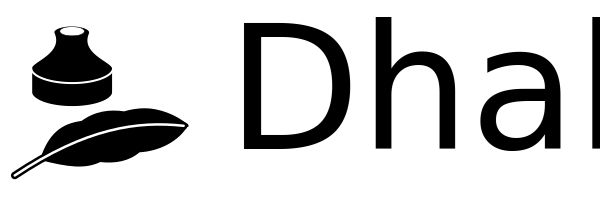

<head>
  <meta charset="UTF-8">
</head> 

Dhall is a programmable configuration language optimized for
maintainability.

You can think of Dhall as: JSON + functions + types + imports

Note that while Dhall is programmable, Dhall is not Turing-complete.  Many
of Dhall's features take advantage of this restriction to provide stronger
safety guarantees and more powerful tooling.

You can try the language live in your browser by visiting the official website:

* [https://dhall-lang.org](http://dhall-lang.org/)

## Getting started

The easiest way to get started experimenting with Dhall is to install the
`dhall-to-json` and/or `dhall-to-yaml` executables, which enable you to
generate JSON and YAML, respectively, on the command line. Platform- and
runtime-specific installation instructions can be found in [the Dhall
wiki][dhall-json-tutorial-wiki].

For other ways to integrate Dhall in your project, read:

* [How to integrate Dhall][dhall-integration-howto]

## Tutorials

For a short introduction, read:

* [Learn Dhall in Y minutes][learn-dhall-in-y-minutes]

To learn more about core language features, read:

* [Core language features][core-language-features]

For an even longer hands-on tutorial, read:

* [Getting started: Generate JSON or YAML][dhall-json-tutorial-wiki]

... and for an even longer tutorial, read:

* [Language Tour][language-tour]

Finally, we have a cheatsheet for a very condensed overview and quick lookup:

* [Dhall Cheatsheet][dhall-cheatsheet]

## What is this repository?

The Dhall configuration language has multiple implementations so that Dhall
configuration files can be understood natively by several programming
languages.  You can find the latest list of the language bindings and their
respective repositories here:

* [How to integrate Dhall - Language support][language-support]

This repository contains language-independent functionality, such as:

* The [grammar and formal semantics](./standard/README.md)

  Dhall is a formally-specified language standard, and language bindings follow
  the specification in order to ensure portability of Dhall configuration files
  across language bindings.

* The [standard test suite](./tests/README.md)

  This repository contains a test suite that language bindings can use to
  check compliance against the standard.

* The [Prelude](./Prelude/README.md)

  One Dhall package named the Prelude is versioned with and distributed
  alongside the language standard.  This package contains general-purpose
  utilities.

* [Shared infrastructure](./nixops/README.md) for the Dhall ecosystem

  Several services support Dhall developers and this repository contains a
  [NixOps](https://nixos.org/nixops/manual/) specification of that
  infrastructure that automatically deploys changes merged to that
  configuration.

## Development status

The current version and versioning policy is detailed in the
[Versioning document](./standard/versioning.md), and you can see the latest
changes [in the Changelog](CHANGELOG.md).

The Dhall configuration language slowly evolves in response to user feedback
and if you would like to participate in the language evolution process then
you should read:

* [`CONTRIBUTING.md` - How do I change the language](.github/CONTRIBUTING.md)

## Design philosophy

Programming languages are all about design tradeoffs and the Dhall language uses
the following guiding principles (in order of descending priority) that help
navigate those tradeoffs:

* Polish

    The language should delight users.  Error messages should be fantastic,
    execution should be snappy, documentation should be excellent, and
    everything should "just work".

* Simplicity

    When in doubt, cut it out.  Every configuration language needs bindings to
    multiple programming languages, and the more complex the configuration
    language the more difficult to create new bindings.  Let the host language
    that you bind to compensate for any missing features from Dhall.

* Beginner-friendliness

    Dhall needs to be a language that anybody can learn in a day and debug
    with little to no assistance from others.  Otherwise people can't recommend
    Dhall to their team with confidence.

* Robustness

    A configuration language needs to be rock solid.  The last thing a person
    wants to debug is their configuration file.  The language should never hang
    or crash.  Ever.

* Consistency

    There should only be one way to do something.  Users should be able to
    instantly discern whether or not something is possible within the Dhall
    language or not.

The Dhall configuration language is also designed to negate many of the common
objections to programmable configuration files, such as:

> "Config files shouldn't be Turing complete"

Dhall is not Turing-complete.  Evaluation always terminates, no exceptions

> "Configuration languages become unreadable due to abstraction and indirection"

Every Dhall configuration file can be reduced to a normal form which eliminates
all abstraction and indirection

> "Users will go crazy with syntax and user-defined constructs"

Dhall is a very minimal programming language.  For example: you cannot even
compare strings for equality.  The language also forbids many other common
operations in order to force users to keep things simple

## Name

The language is named after a
[Dustman from the game Planescape: Torment][dhall-name] who belongs to a faction
obsessed with death (termination).  The fountain pen in the logo is the modern
analog of Dhall's quill.

The name rhymes with "tall"/"call"/"hall" (i.e. "dɔl" for a US speaker or
"dɔːl" for a UK speaker using the International Phonetic Alphabet).

## Contributors

### Code Contributors

This project exists thanks to all the people who contribute. [[Contribute](.github/CONTRIBUTING.md)].

### Financial Contributors

Become a financial contributor and help us sustain our community. [[Contribute](https://opencollective.com/dhall/contribute)]

#### Individuals

#### Organizations

Support this project with your organization. Your logo will show up here with a link to your website. [[Contribute](https://opencollective.com/dhall/contribute)]

[dhall-haskell]: https://github.com/dhall-lang/dhall-haskell
[dhall-haskell-tutorial]: https://hackage.haskell.org/package/dhall/docs/Dhall-Tutorial.html
[dhall-haskell-post]: http://www.haskellforall.com/2016/12/dhall-non-turing-complete-configuration.html
[dhall-nix]: https://github.com/dhall-lang/dhall-nix
[dhall-nix-tutorial]: https://hackage.haskell.org/package/dhall-nix/docs/Dhall-Nix.html
[dhall-nix-post]: http://www.haskellforall.com/2017/01/typed-nix-programming-using-dhall.html
[dhall-ruby]: https://git.sr.ht/~singpolyma/dhall-ruby
[dhall-ruby-rubydoc]: https://www.rubydoc.info/gems/dhall
[dhall-ruby-rubygems]: https://rubygems.org/gems/dhall
[dhall-clj]: https://github.com/f-f/dhall-clj
[dhall-purescript]: https://github.com/MonoidMusician/dhall-purescript
[dhall-eta]: https://github.com/eta-lang/dhall-eta
[dhall-python]: https://github.com/SupraSummus/dhall-python
[dhall-scala]: https://github.com/amarpotghan/dhall-scala
[dhall-json]: https://github.com/dhall-lang/dhall-json
[dhall-json-tutorial]: https://hackage.haskell.org/package/dhall-json/docs/Dhall-JSON.html
[dhall-json-post]: http://www.haskellforall.com/2017/02/program-json-and-yaml-with-dhall.html
[dhall-bash]: https://github.com/dhall-lang/dhall-bash
[dhall-bash-tutorial]: https://hackage.haskell.org/package/dhall-bash/docs/Dhall-Bash.html
[dhall-bash-post]: http://www.haskellforall.com/2017/04/use-dhall-to-configure-bash-programs.html
[dhall-text]: https://github.com/dhall-lang/dhall-haskell/tree/master/dhall-text
[dhall-text-post]: http://www.haskellforall.com/2017/06/dhall-is-now-template-engine.html
[dhallToNix]: https://github.com/NixOS/nixpkgs/blob/master/pkgs/build-support/dhall-to-nix.nix
[dhall-name]: http://torment.wikia.com/wiki/Dhall
[dhall-prelude]: https://prelude.dhall-lang.org
[hcl]: https://github.com/hashicorp/hcl
[learn-dhall-in-y-minutes]: https://learnxinyminutes.com/docs/dhall/
[readme-before-nat-int-swap]: https://github.com/dhall-lang/dhall-lang/blob/1b74481c87b3ed83ecd613420c11de92335652a3/README.md
[migration-nat-int-swap]: https://docs.dhall-lang.org/howtos/migrations/Swapped-syntax-for-Natural-numbers-and-Integers.html
[issue-tracker]: https://github.com/dhall-lang/dhall-lang/issues
[core-language-features]: https://docs.dhall-lang.org/discussions/Core-language-features.html
[dhall-json-tutorial-wiki]: https://docs.dhall-lang.org/tutorials/Getting-started_Generate-JSON-or-YAML.html
[dhall-integration-howto]: https://docs.dhall-lang.org/howtos/How-to-integrate-Dhall.html
[dhall-cheatsheet]: https://docs.dhall-lang.org/howtos/Cheatsheet.html
[language-tour]: https://docs.dhall-lang.org/tutorials/Language-Tour.html
[language-support]: https://docs.dhall-lang.org/howtos/How-to-integrate-Dhall.html#language-support
