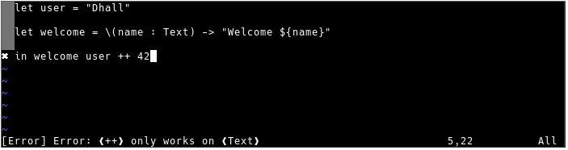
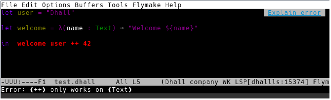
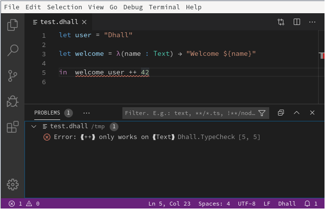

# Text Editor Configuration

You can use the language server protocol `dhall-lsp-server` with different editors:

* [Vim](#VIM)
* [Emacs](#EMACS)
* [Visual Studio Code](#vscode)

The current LSP implementation features the following extensions:

* completion
* documentFormatting
* hover

Follow the [install instructions][installation] from the getting started tutorial
to download the `dhall-lsp-server`. Make sure the command is in your search `PATH`.

[installation]: <tutorials/Getting-started_Generate-JSON-or-YAML:installation>


## VIM

Using [LanguageClient](https://github.com/autozimu/LanguageClient-neovim):



### Installation

#### Using `vim-plug`

If it is not already installed, you can setup vim-plug by running:

```console
curl -fLo ~/.vim/autoload/plug.vim --create-dirs \
  https://raw.githubusercontent.com/junegunn/vim-plug/master/plug.vim
```

Then add this to your `~/.vimrc` file:

```
call plug#begin('~/.local/share/nvim/plugged')

Plug 'autozimu/LanguageClient-neovim', {
    \ 'branch': 'next',
    \ 'do': 'bash install.sh',
    \ }

Plug 'vmchale/dhall-vim'

call plug#end()
```

Finally, restart vim and run `:PlugInstall`

### Configuration

To enable dhall-lsp-server with vim LanguageClient, add this to your `~/.vimrc` file:

```
let g:LanguageClient_serverCommands = {
    \ 'dhall': ['dhall-lsp-server'],
    \ }

" comment the next line to disable automatic format on save
let g:dhall_format=1

" Always draw sign column. Prevent buffer moving when adding/deleting sign.
set signcolumn=yes

" Required for operations modifying multiple buffers like rename.
set hidden

" Map keybinding
nnoremap <F5> :call LanguageClient_contextMenu()<CR>
nnoremap <silent> K :call LanguageClient#textDocument_hover()<CR>
```

### Usage

Here are the commands you need to know:

Keys | Action
---- | ------
`C-x C-o` | auto complete, should work automatically when using deoplete/nvim-completion-manager
`:cn` or `:cp` | navigate to the next or previous error
`K` | describe thing
`F5` | show all lsp client functions


## EMACS

Using [lsp-mode](https://github.com/emacs-lsp/lsp-mode):



### Installation

#### Using `use-package`

If it is not already installed, you can setup `use-package` by adding this to your `~/.emacs.d/init.el` file:

```emacs-lisp
;; setup melpa
(require 'package)
(add-to-list 'package-archives '("melpa" . "https://melpa.org/packages/"))
(package-initialize)
(unless package-archive-contents
  (package-refresh-contents))

;; install use-package
(unless (package-installed-p 'use-package)
  (package-install 'use-package))
```

Or read the other possible integration at [lsp-mode configuration][lsp-mode-configuration]

### Configuration

To enable dhall-lsp-server with emacs lsp-mode, add this to your `~/.emacs.d/init.el` file:

```emacs-lisp
;; dhall-mode highlight the syntax and run dhall format on save
(use-package dhall-mode
  :ensure t
  :config
  (setq
    ;; uncomment the next line to disable automatic format
    ;; dhall-format-at-save nil

    ;; comment the next line to use unicode syntax
    dhall-format-arguments (\` ("--ascii"))

    ;; header-line is obsoleted by lsp-mode
    dhall-use-header-line nil))

;; lsp-mode provides the lsp client and it configure flymake to explain errors
(use-package lsp-mode
  :ensure t
  :init (setq lsp-keymap-prefix "C-c l")
  :hook ((dhall-mode . lsp))
  :commands lsp)
```

For a more complete integration, add these extra packages:

```emacs-lisp
;; lsp-ui shows type annotations on hover
(use-package lsp-ui
  :ensure t
  :hook ((lsp-mode-hook . lsp-ui-mode)))

;; company-lsp simplifies completion-at-point
(use-package company-lsp
  :ensure t
  :after company
  :init
    (push 'company-lsp company-backends))
```

Check [lsp-mode configuration][lsp-mode-configuration] to configure `helm`, `ivy` and `which-key`.


### Usage

Here are the commands you need to know:

* completion-at-point
* flymake-goto-next-error
* lsp-describe-thing-at-point  (not needed when using `lsp-ui`)
* lsp-describe-session

[lsp-mode-configuration]: https://github.com/emacs-lsp/lsp-mode#configure-lsp-mode


## vscode

Using [PanAeon/vscode-dhall-lsp-server][vscode-dhall]:




### Installation

Click on the `Extensions` button and install:

* Dhall Language Support
* Dhall LSP Server


### Configuration and Usage

Check the extensions [README][vscode-dhall]

[vscode-dhall]: https://github.com/PanAeon/vscode-dhall-lsp-server
