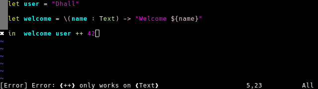
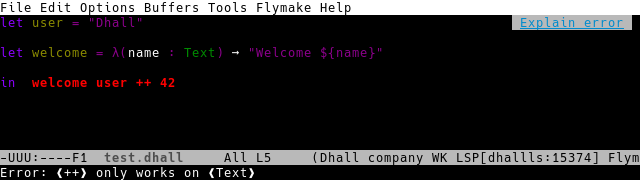

# Text Editor Configuration

You can use the language server protocol `dhall-lsp-server` with different editors.

```eval_rst
.. contents:: Table of Contents
   :depth: 2
   :backlinks: none
```

> TODO: document dhall-lsp-server installation
> TODO: document vscode configuration

## VIM

Using [LanguageClient](https://github.com/autozimu/LanguageClient-neovim):



### Installation

#### Manually

Install the plugin manually by running:

```console
mkdir -p ~/.vim-plugins
cd ~/.vim-plugins
git clone --depth 1 https://github.com/autozimu/LanguageClient-neovim.git
cd LanguageClient-neovim
bash install.sh
```

Then add this to your `~/.vimrc` file:

```
set runtimepath+=~/.vim-plugins/LanguageClient-neovim
```

#### Using `vim-plug`

If it is not already installed, you can setup vim-plug by running:

```console
curl -fLo ~/.vim/autoload/plug.vim --create-dirs \
  https://raw.githubusercontent.com/junegunn/vim-plug/master/plug.vim
```

Then add this to your `~/.vimrc` file:

```
call plug#begin('~/.local/share/nvim/plugged')

Plug 'autozimu/LanguageClient-neovim', {
    \ 'branch': 'next',
    \ 'do': 'bash install.sh',
    \ }

call plug#end()
```

### Configuration

To enable dhall-lsp-server with vim LanguageClient, add this to your `~/.vimrc` file:

```
augroup filetype_dhall
    autocmd!
    autocmd BufReadPost *.dhall setlocal filetype=dhall
augroup END

let g:LanguageClient_serverCommands = {
    \ 'dhall': ['/usr/bin/dhall-lsp-server'],
    \ }

" Always draw sign column. Prevent buffer moving when adding/deleting sign.
set signcolumn=yes
" Required for operations modifying multiple buffers like rename.
set hidden
```


## EMACS

Using [lsp-mode](https://github.com/emacs-lsp/lsp-mode):



### Installation

#### Using `use-package`

If it is not already installed, you can setup `use-package` by adding this to your `~/.emacs.d/init.el` file:

```emacs-lisp
;; setup melpa
(require 'package)
(add-to-list 'package-archives '("melpa" . "https://melpa.org/packages/"))
(package-initialize)
(unless package-archive-contents
  (package-refresh-contents))

;; install use-package
(unless (package-installed-p 'use-package)
  (package-install 'use-package))
(setq use-package-always-ensure t)
```

Or read the other possible integration at:
https://github.com/emacs-lsp/lsp-mode#configure-lsp-mode
To make it work with dhall, you just need to enable the dhall-mode hook:

```emacs-lisp
(add-hook 'dhall-mode-hook #'lsp-deferred)
```

### Configuration

To enable dhall-lsp-server with emacs lsp-mode, add this to your `~/.emacs.d/init.el` file:

```emacs-lisp
(use-package dhall-mode
  :config
  (setq
    dhall-format-arguments (\` ("--ascii"))
    dhall-use-header-line nil))

(use-package lsp-mode
  :hook ((dhall-mode . lsp))
  :commands lsp)
```

### Usage

Here are the commands and default keybindings you need to know:

* M-x flymake-goto-next-error
